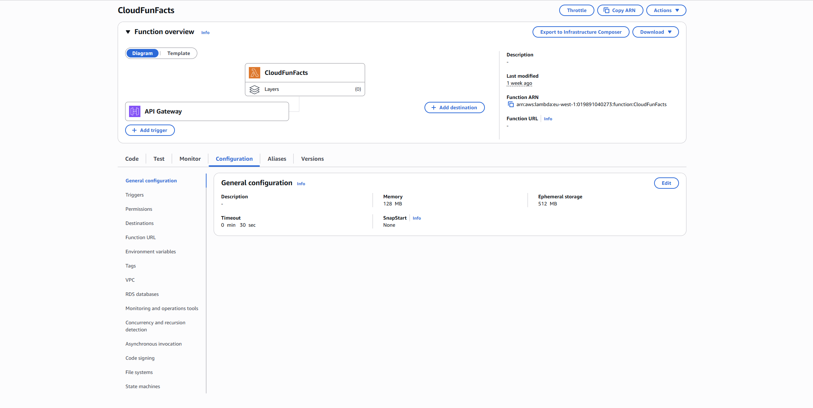
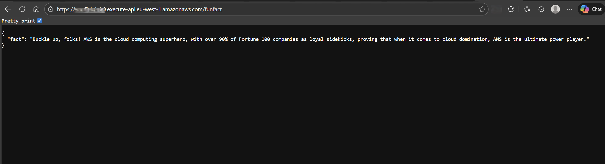
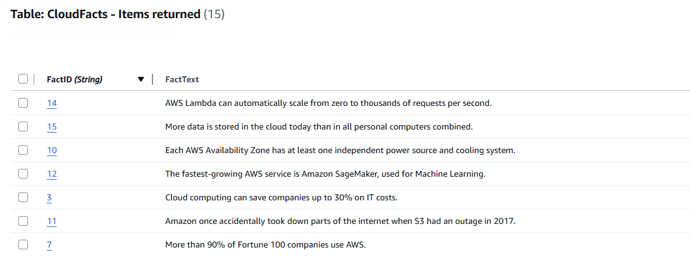
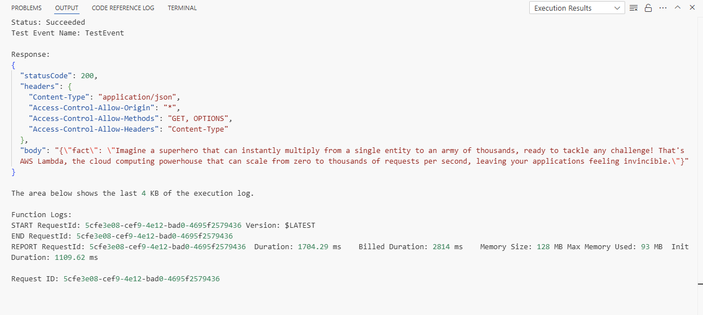

# ☁️ Cloud Fun Facts Generator


A small serverless AWS project that delivers random cloud computing facts through a public API and a simple web frontend.  
The goal of this project is to demonstrate how multiple AWS services integrate in a real, end-to-end application.

---

## What It Does

- Provides a public `/funfact` API endpoint
- Retrieves cloud facts from DynamoDB
- Optionally enhances facts using Amazon Bedrock (GenAI)
- Displays results in a static frontend hosted on AWS Amplify

---

## Architecture Overview

1. User clicks **Generate Fun Fact** in the browser  
2. Frontend calls an API Gateway HTTP endpoint  
3. API Gateway invokes an AWS Lambda function  
4. Lambda retrieves a fact from DynamoDB  
5. Lambda sends the fact to Amazon Bedrock for AI-generated wording (Optional)
6. The response is returned to the frontend  

All services are fully managed and serverless.

### Lambda Configuration



### API Response Example



---

## AWS Services Used

- **AWS Lambda** – Serverless backend logic  
- **Amazon API Gateway (HTTP API)** – Public API endpoint  
- **Amazon DynamoDB** – Stores cloud facts  
- **Amazon Bedrock** – Optional AI-generated responses  
- **AWS Amplify** – Static frontend hosting  
- **AWS IAM** – Service permissions  

---

## Project Evolution

The project was built incrementally to reflect how real applications evolve.

### Stage 1: Serverless API

- Lambda returns random cloud facts
- API Gateway exposes the `/funfact` endpoint

### Stage 2: DynamoDB Integration

- Facts stored in a DynamoDB table
- Lambda retrieves data dynamically



### Stage 3: GenAI Enhancement

- Amazon Bedrock (Claude 3 Sonnet) rewrites facts in a short, witty format
- Graceful fallback if AI output fails



### Stage 4: Frontend Deployment

- Simple HTML/CSS/JavaScript frontend
- Hosted on AWS Amplify with HTTPS

---

## DynamoDB Table Structure

Table name: `CloudFacts`

| Attribute | Type   | Description   |
|---------|--------|---------------|
| FactID  | String | Partition key |
| FactText| String | Fact content  |

---

## Lambda Permissions

The Lambda execution role includes:

- CloudWatch Logs access  
- Read-only access to DynamoDB  
- Access to Amazon Bedrock (optional)  

---

## Frontend Configuration

The frontend is a single `index.html` file that calls the API Gateway endpoint.  
The API URL is defined directly in the JavaScript section:

```js
const API_URL = 'https://<api-id>.execute-api.<region>.amazonaws.com/funfact';
